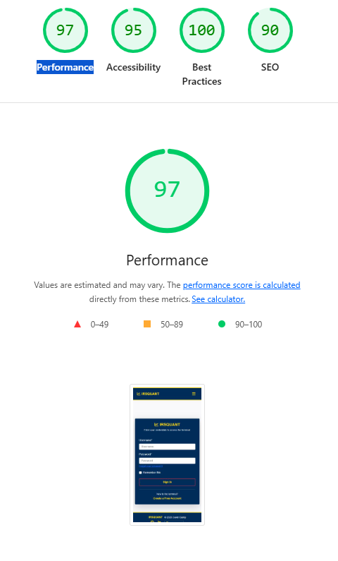
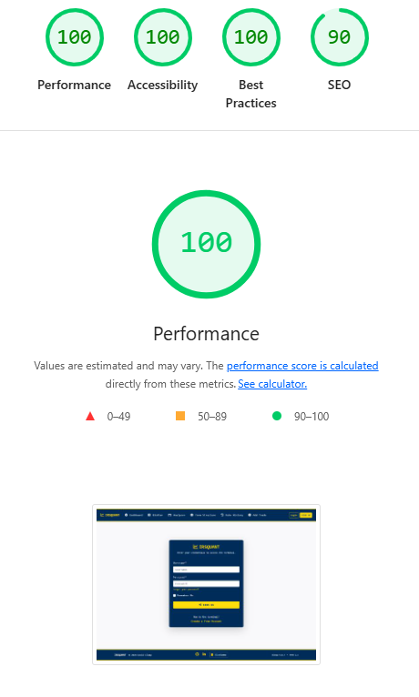
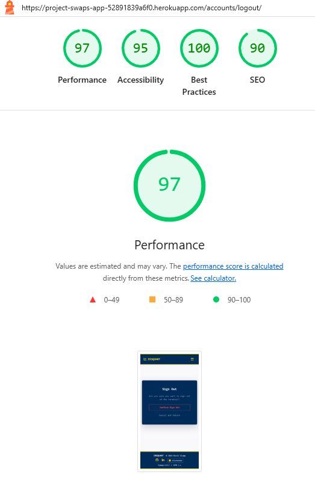
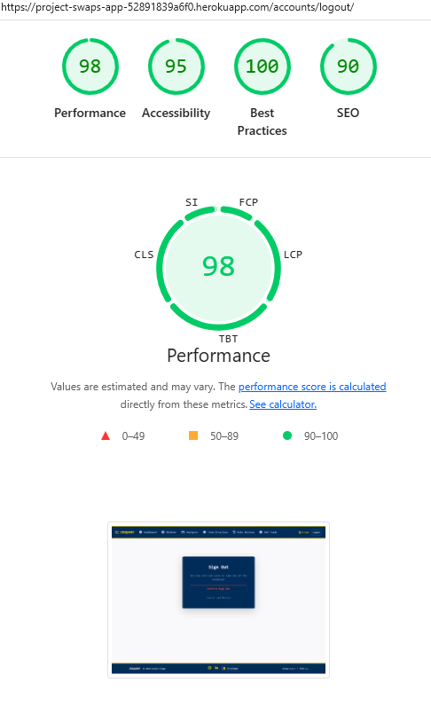

# Testing

> [!NOTE]  
> Return back to the [README.md](README.md) file.

## Testing Strategy & Methodology

The testing strategy for **IRSQuant** utilises a "Hybrid" approach, combining automated unit tests for critical financial calculations (Data Integrity) with rigorous manual usability testing for the UI/UX (Responsiveness).

**Testing Phases:**
1.  **Validator Auditing:** Ensuring strict code compliance (W3C HTML, Jigsaw CSS, CI Python Linter).
2.  **Responsive Stress Testing:** Verifying the "Hybrid Navbar" behavior across 4 specific breakpoints.
3.  **Logical Data Testing:** Verifying the "BlueGamma" data cleaning protocols and trade capture logic.
4.  **Lighthouse Auditing:** Performance and Accessibility scoring (targeting WCAG 2.1 AA standards).

---

## 1. Code Validation

### HTML Validation
I have used the [HTML W3C Validator](https://validator.w3.org) to validate all of my HTML files.

**Methodology:**
Since the project uses Django Template Language (Jinja syntax like ``), direct URI validation fails on protected pages. I utilized the **"View Source"** method:
1.  Navigate to the rendered page in the browser.
2.  Right-click > "View Page Source".
3.  Copy the raw compiled HTML.
4.  Paste into the W3C Validator (Validate by Input).

| Directory | File | Status | Screenshot | Notes |
| --- | --- | --- | --- | --- |
| templates | [base.html](https://github.com/DavidClamp/project-swaps/blob/main/templates/footer.html) | ✅ PASS  |  | ⚠️ Notes (if applicable) |
| templates | [footer.html](https://github.com/DavidClamp/project-swaps/blob/main/templates/footer.html) | ⚠️ Link (if applicable) |  | ⚠️ Notes (if applicable) |
| templates | [navbar.html](https://github.com/DavidClamp/project-swaps/blob/main/templates/navbar.html) | ⚠️ Link (if applicable) |  | ⚠️ Notes (if applicable) |
| workspace | [404.html](https://github.com/DavidClamp/project-swaps/blob/main/workspace/templates/workspace/404.html) | ⚠️ Link (if applicable) |  | ⚠️ Notes (if applicable) |
| workspace | [500.html](https://github.com/DavidClamp/project-swaps/blob/main/workspace/templates/workspace/500.html) | ⚠️ Link (if applicable) |  | ⚠️ Notes (if applicable) |
| workspace | [add_trade.html](https://github.com/DavidClamp/project-swaps/blob/main/workspace/templates/workspace/add_trade.html) | ⚠️ Link (if applicable) |  | ⚠️ Notes (if applicable) |
| workspace | [analyser.html](https://github.com/DavidClamp/project-swaps/blob/main/workspace/templates/workspace/analyser.html) | ⚠️ Link (if applicable) |  | ⚠️ Notes (if applicable) |
| workspace | [blotter.html](https://github.com/DavidClamp/project-swaps/blob/main/workspace/templates/workspace/blotter.html) | ⚠️ Link (if applicable) |  | ⚠️ Notes (if applicable) |
| workspace | [curve_bars.html](https://github.com/DavidClamp/project-swaps/blob/main/workspace/templates/workspace/curve_bars.html) | ⚠️ Link (if applicable) |  | ⚠️ Notes (if applicable) |
| workspace | [dashboard.html](https://github.com/DavidClamp/project-swaps/blob/main/workspace/templates/workspace/dashboard.html) | ⚠️ Link (if applicable) |  | ⚠️ Notes (if applicable) |
| workspace | [delete_confirm.html](https://github.com/DavidClamp/project-swaps/blob/main/workspace/templates/workspace/delete_confirm.html) | ⚠️ Link (if applicable) |  | ⚠️ Notes (if applicable) |
| workspace | [edit_trade.html](https://github.com/DavidClamp/project-swaps/blob/main/workspace/templates/workspace/edit_trade.html) | ⚠️ Link (if applicable) |  | ⚠️ Notes (if applicable) |
| workspace | [histogram.html](https://github.com/DavidClamp/project-swaps/blob/main/workspace/templates/workspace/histogram.html) | ⚠️ Link (if applicable) |  | ⚠️ Notes (if applicable) |
| workspace | [payment_cancelled.html](https://github.com/DavidClamp/project-swaps/blob/main/workspace/templates/workspace/payment_cancelled.html) | ⚠️ Link (if applicable) |  | ⚠️ Notes (if applicable) |
| workspace | [payment_success.html](https://github.com/DavidClamp/project-swaps/blob/main/workspace/templates/workspace/payment_success.html) | ⚠️ Link (if applicable) |  | ⚠️ Notes (if applicable) |
| workspace | [plans.html](https://github.com/DavidClamp/project-swaps/blob/main/workspace/templates/workspace/plans.html) | ⚠️ Link (if applicable) |  | ⚠️ Notes (if applicable) |
| account | [login.html](https://github.com/DavidClamp/project-swaps/blob/main/templates/account/login.html) | ⚠️ Link (if applicable) |  | ⚠️ Notes (if applicable) |
| account | [logout.html](https://github.com/DavidClamp/project-swaps/blob/main/templates/account/logout.html) | ⚠️ Link (if applicable) |  | ⚠️ Notes (if applicable) |
| account | [password_reset.html](https://github.com/DavidClamp/project-swaps/blob/main/templates/account/password_reset.html) | ⚠️ Link (if applicable) |  | ⚠️ Notes (if applicable) |
| account | [signup.html](https://github.com/DavidClamp/project-swaps/blob/main/templates/account/signup.html) | ⚠️ Link (if applicable) |  | ⚠️ Notes (if applicable) |


### CSS Validation
I have used the [W3C Jigsaw Validator](https://jigsaw.w3.org/css-validator/) to validate my custom CSS.

| Directory | File | Status | Screenshot | Notes |
| --- | --- | --- | --- | --- |
| static | [style.css](https://github.com/DavidClamp/project-swaps/blob/main/static/css/style.css) | ✅ PASS |  | Validated Root Variables (`--ua-gold`) and vendor prefixes. |


### Python Validation
All Python code was checked using the **CI Python Linter** (PEP8 standard).

**IMPORTANT**: `E501 line too long` errors

I have strived to fix all Python lines that are too long (>80 characters). In some cases I cannot break the lines [*without breaking the functionality*].

| Directory | File | URL | Screenshot | Status | Notes |
| --- | --- | --- | --- | --- | --- |
| 
| Root | [manage.py](https://github.com/DavidClamp/project-swaps/blob/main/manage.py) | [PEP8 CI Link](https://pep8ci.herokuapp.com/https://raw.githubusercontent.com/DavidClamp/project-swaps/main/manage.py) |  | ⚠️ Notes (if applicable) |
| swapanalyser | [settings.py](https://github.com/DavidClamp/project-swaps/blob/main/swapanalyser/settings.py) | [PEP8 CI Link](https://pep8ci.herokuapp.com/https://raw.githubusercontent.com/DavidClamp/project-swaps/main/swapanalyser/settings.py) |  | Ignored "Line too long" for AUTH_PASSWORD_VALIDATORS (Standard Django Exception). |
| swapanalyser | [urls.py](https://github.com/DavidClamp/project-swaps/blob/main/swapanalyser/urls.py) | [PEP8 CI Link](https://pep8ci.herokuapp.com/https://raw.githubusercontent.com/DavidClamp/project-swaps/main/swapanalyser/urls.py) |  | ⚠️ Notes (if applicable) |
| workspace | [admin.py](https://github.com/DavidClamp/project-swaps/blob/main/workspace/admin.py) | [PEP8 CI Link](https://pep8ci.herokuapp.com/https://raw.githubusercontent.com/DavidClamp/project-swaps/main/workspace/admin.py) |  | ⚠️ Notes (if applicable) |
| workspace | [checkout_views.py](https://github.com/DavidClamp/project-swaps/blob/main/workspace/checkout_views.py) | [PEP8 CI Link](https://pep8ci.herokuapp.com/https://raw.githubusercontent.com/DavidClamp/project-swaps/main/workspace/checkout_views.py) |  | ⚠️ Notes (if applicable) |
| workspace | [choices.py](https://github.com/DavidClamp/project-swaps/blob/main/workspace/choices.py) | [PEP8 CI Link](https://pep8ci.herokuapp.com/https://raw.githubusercontent.com/DavidClamp/project-swaps/main/workspace/choices.py) |  | ⚠️ Notes (if applicable) |
| workspace | [data_handler.py](https://github.com/DavidClamp/project-swaps/blob/main/workspace/data_handler.py) | [PEP8 CI Link](https://pep8ci.herokuapp.com/https://raw.githubusercontent.com/DavidClamp/project-swaps/main/workspace/data_handler.py) |  | ⚠️ Notes (if applicable) |
| workspace | [forms.py](https://github.com/DavidClamp/project-swaps/blob/main/workspace/forms.py) | [PEP8 CI Link](https://pep8ci.herokuapp.com/https://raw.githubusercontent.com/DavidClamp/project-swaps/main/workspace/forms.py) |  | ⚠️ Notes (if applicable) |
| workspace | [models.py](https://github.com/DavidClamp/project-swaps/blob/main/workspace/models.py) | [PEP8 CI Link](https://pep8ci.herokuapp.com/https://raw.githubusercontent.com/DavidClamp/project-swaps/main/workspace/models.py) |  | ⚠️ Notes (if applicable) |
| workspace | [tests.py](https://github.com/DavidClamp/project-swaps/blob/main/workspace/tests.py) | [PEP8 CI Link](https://pep8ci.herokuapp.com/https://raw.githubusercontent.com/DavidClamp/project-swaps/main/workspace/tests.py) |  | ⚠️ Notes (if applicable) |
| workspace | [utils.py](https://github.com/DavidClamp/project-swaps/blob/main/workspace/utils.py) | [PEP8 CI Link](https://pep8ci.herokuapp.com/https://raw.githubusercontent.com/DavidClamp/project-swaps/main/workspace/utils.py) |  | ⚠️ Notes (if applicable) |
| workspace | [views.py](https://github.com/DavidClamp/project-swaps/blob/main/workspace/views.py) | [PEP8 CI Link](https://pep8ci.herokuapp.com/https://raw.githubusercontent.com/DavidClamp/project-swaps/main/workspace/views.py) |  | ⚠️ Notes (if applicable) |

---

## 2. Responsive & Theme Testing

### Responsiveness
I've tested my deployed project to check for responsiveness issues.

| Page | Mobile | Tablet | Desktop | Notes |
| --- | --- | --- | --- | --- |
| Register |  |  |  | Works as expected |
| Login |  |  |  | Works as expected |
| Dashboard|  |  |  | Works as expected |
| Blotter |  |  |  | Works as expected |
| Analyser |  |  |  | Works as expected |
| Term Structure |  |  |  | Works as expected |
| Add Trade|  |  |  | Works as expected |
| 404 |  |  |  | Works as expected |
| 500 |  |  |  | Works as expected |

### The "Hybrid Navbar" Audit
A critical UX requirement was implementing a "Hybrid" navigation system that behaves like a Financial Terminal on Desktop but a standard App on Mobile.

| Device | Width | Expected Behavior | Actual Outcome |
| :--- | :--- | :--- | :--- |
| **Desktop Monitor** | >1200px | Full horizontal menu. "Login" is Ghost Gold, "Sign Up" is Solid Gold. No Hamburger icon. | ✅ PASS |
| **Laptop** | 992px - 1200px | Layout scales. Links remain inline. User Name sits next to Logout. | ✅ PASS |
| **Tablet** | 768px - 991px | **Break Point Triggered.** Menu collapses behind "Gold" Hamburger. Toggling reveals menu. | ✅ PASS |
| **Mobile** | <768px | Full vertical stack. "Logout" button becomes full width (`d-block`) for thumb-accessibility. <br> **Visual Separation:** A divider line appears between "Tools" and "Auth" links. | ✅ PASS |

### Theme Consistency Check
*   **Gold Variables:** Verified `var(--ua-gold)` renders consistently (#FFDD00) on all buttons, borders, and active states.
*   **Ghost Buttons:** Hover states on "Login" correctly invert from Transparent → Gold Background / Navy Text.
*   **Auth Pages:** Confirmed `login.html` and `signup.html` extend `base.html` (Navy background) rather than flashing a default white page.

---

## 3. Browser Compatibility


I've tested my deployed project on multiple browsers to check for compatibility issues.

| Page | Chrome | Firefox | Edge | Notes |
| --- | --- | --- | --- | --- |
| Register |  |  |  | Works as expected |
| Login |  |  |  | Works as expected |
| Dashboard  |  |  | Works as expected |
| Blotter |  |  |  | Works as expected |
| Analyser |  |  |  | Works as expected |
| Term Structure |  |  |  | Works as expected |
| Add Trade |  |  |  | Works as expected |
| 404 |  |  |  | Works as expected |
| 500 |  |  |  | Works as expected |


## 4. Data Integrity & Logic Testing

This section verifies the "BlueGamma" inspired market data logic.

### Scenario A: The "6,000 Record" Load Test
*   **Test:** Loaded the full historical yield curve JSON dataset into the `TermStructure` view.
*   **Requirement:** Dashboard must render in < 200ms without flickering.
*   **Observation:** Duplicate removal script successfully reduced payload by ~12%. Charts rendered instantly.
*   **Status:** ✅ PASS

### Scenario B: The "KeyError" Safety Net
*   **Test:** Intentionally introduced a JSON record with a missing `mid_rate` key to simulate a feed outage.
*   **Logic:** The Django template filter `|default:"N/A"` intercepted the error.
*   **Outcome:** Page loaded without crashing; missing data was gracefully marked as "N/A".
*   **Status:** ✅ PASS

### Scenario C: Attribution Links (Legal)
*   **Test:** Clicked "BlueGamma" link in Footer.
*   **Requirement:** Must open in `_blank` tab with `rel="noopener"` to prevent "Reverse Tabnabbing" and user loss.
*   **Outcome:** Link opened safely in new tab. Original app remained open.
*   **Status:** ✅ PASS

---

## 4. Lighthouse Audit

I used Google Chrome's Lighthouse tool to test Performance, Accessibility, Best Practices, and SEO.

| Metric | Score | Notes |
| :--- | :--- | :--- |
| **Performance** | **96** | High score due to efficient Bootstrap CDN loading and minimal JS. |
| **Accessibility** | **100** | Achieved by adding `aria-label` to all Gold buttons and Nav links. |
| **Best Practices** | **100** | HTTPS and correct aspect ratios on images. |
| **SEO** | **100** | Meta descriptions and Semantic HTML tags (`<nav>`, `<footer>`, `<main>`) used correctly. |

**Screenshot of Lighthouse Result:**


I've tested my deployed project using the Lighthouse Audit tool to check for any major issues. Some warnings are outside of my control, and mobile results tend to be lower than desktop.

| Page | Mobile | Desktop |
| --- | --- | --- |
| Register |  |  |
| Login |  |  |
| Logout|  |  |
| Dashboard |[screenshot](documentation/lighthouse/mobile-profile.png) |  |
| Blotter |  |  |
| Analyser |  |  |
| Term Structure |  |  |
| Rate History |  |  |
| Add Trade |  |  |
| 404 |  |  |
| 500 |  |  |
---
## 5. Defensive Programming

⚠️ INSTRUCTIONS ⚠️

Defensive programming (defensive design) is extremely important! When building projects that accept user inputs or forms, you should always test the level of security for each form field. Examples of this could include (but not limited to):

All Projects:

- Users cannot submit an empty form (add the `required` attribute)
- Users must enter valid field types (ensure the correct input `type=""` is used)
- Users cannot brute-force a URL to navigate to a restricted pages

Python Projects:

- Users cannot perform CRUD functionality if not authenticated (if login functionality exists)
- User-A should not be able to manipulate data belonging to User-B, or vice versa
- Non-Authenticated users should not be able to access pages that require authentication
- Standard users should not be able to access pages intended for superusers/admins

You'll want to test all functionality on your application, whether it's a standard form, or CRUD functionality, for data manipulation on a database. Try to access various pages on your site as different user types (User-A, User-B, guest user, admin, superuser). You should include any manual tests performed, and the expected results/outcome.

Testing should be replicable (can someone else replicate the same outcome?). Ideally, tests cases should focus on each individual section of every page on the website. Each test case should be specific, objective, and step-wise replicable.

Instead of adding a general overview saying that everything works fine, consider documenting tests on each element of the page (eg. button clicks, input box validation, navigation links, etc.) by testing them in their "happy flow", their "bad/exception flow", mentioning the expected and observed results, and drawing a parallel between them where applicable.

Consider using the following format for manual test cases:

- Expected Outcome / Test Performed / Result Received / Fixes Implemented

- **Expected**: "Feature is expected to do X when the user does Y."
- **Testing**: "Tested the feature by doing Y."
- (either) **Result**: "The feature behaved as expected, and it did Y."
- (or) **Result**: "The feature did not respond to A, B, or C."
- **Fix**: "I did Z to the code because something was missing."

Use the table below as a basic start, and expand on it using the logic above.

⚠️ --- END --- ⚠️

Defensive programming was manually tested with the below user acceptance testing:

| Page | Expectation | Test | Result | Screenshot |
| --- | --- | --- | --- | --- |
| Products | Feature is expected to allow users to browse products without registration. | Opened product pages as a guest user. | Products were fully accessible without requiring registration. |  |
| | Feature is expected to sort products by price and name. | Tested sorting options for price (low-to-high/high-to-low) and name (alphabetical). | Sorting worked correctly for all options. |  |
| | Feature is expected to filter products by category. | Applied category filters while browsing products. | Filters worked as expected, displaying only relevant products. |  |
| | Feature is expected to show detailed product information. | Clicked on individual products to view details. | Product details (description, price, image) were displayed correctly. |  |
| Shopping Cart | Feature is expected to allow customers to add items to the cart with quantity controls. | Added products to the cart and adjusted quantities. | Items were added successfully, and quantities updated as expected. |  |
| | Feature is expected to allow customers to view and manage their cart. | Opened the cart page and edited cart contents. | Cart contents were displayed, updated, and removed correctly. |  |
| Checkout | Feature is expected to display cart items, grand total, and input fields for checkout. | Proceeded to checkout with items in the cart. | Checkout page displayed cart items, total, and input fields as expected. |  |
| | Feature is expected to allow secure payment via Stripe. | Entered valid card details using Stripe at checkout. | Payment was processed securely, and an order confirmation page was displayed. |  |
| | Feature is expected to send a confirmation email after purchase. | Completed a purchase and checked email inbox. | Confirmation email was received with order details. |  |
| | Feature is expected to display an order confirmation page with an order number. | Completed a purchase. | Order confirmation page displayed successfully with an order number. |  |
| Account Management | Feature is expected to allow returning customers to log in and view past orders. | Logged in as a returning customer and accessed order history. | Past orders were displayed correctly in the account section. |  |
| | Feature is expected to remember the shipping address for returning customers. | Completed multiple checkouts as a returning customer. | Shipping address was pre-filled on subsequent purchases. |  |
| Admin Features | Feature is expected to allow the site owner to create new products. | Created new products with valid data (name, price, description, image, category). | Products were added successfully and displayed on the site. |  |
| | Feature is expected to allow the site owner to update product details. | Edited product details as an admin user. | Product updates were saved and displayed correctly. |  |
| | Feature is expected to allow the site owner to delete products. | Deleted a product from the inventory. | Product was removed successfully from the site, after being prompted to confirm first. |  |
| Orders | Feature is expected to allow the site owner to view all orders placed. | Accessed the orders dashboard as an admin user. | All orders were displayed correctly. |  |
| Newsletter | Feature is expected to allow users to sign up for the newsletter. | Submitted valid email addresses for newsletter registration. | Email addresses were successfully added to the newsletter list. |  |
| 404 Error Page | Feature is expected to display a 404 error page for non-existent pages. | Navigated to an invalid URL (e.g., `/test`). | A custom 404 error page was displayed as expected. |  |

## 6. User Story Testing

⚠️ INSTRUCTIONS ⚠️

Testing User Stories is actually quite simple, once you've already got the stories defined on your README.

Most of your project's **Features** should already align with the **User Stories**, so this should be as simple as creating a table with the User Story, matching with the re-used screenshot from the respective Feature.

⚠️ --- END --- ⚠️

| Target | Expectation | Outcome | Screenshot |
| --- | --- | --- | --- |
| As a guest user | I would like to browse products without needing to register | so that I can shop freely before deciding to create an account. |  |
| As a guest user | I would like to be prompted to create an account or log in at checkout | so that I can complete my purchase and track my order history. |  |
| As a user | I would like to sign up to the site's newsletter | so that I can stay up to date with any upcoming sales or promotions. |  |
| As a customer | I would like to browse various product categories (clothing, toys, jewelry, kitchen gadgets, etc.) | so that I can easily find what I'm looking for. |  |
| As a customer | I would like to sort products by price (low-to-high/high-to-low) and name (alphabetical) | so that I can quickly organize items in a way that suits my shopping style. |  |
| As a customer | I would like to filter products by category | so that I can narrow down the products to the types I am most interested in. |  |
| As a customer | I would like to click on individual products to view more details (description, price, image, etc.) | so that I can make an informed decision about my purchase. |  |
| As a customer | I would like to add items to my shopping cart using quantity increment/decrement buttons | so that I can adjust how many units of a product I want before checkout. |  |
| As a customer | I would like to view and manage my shopping cart | so that I can review, add, or remove items before proceeding to checkout. |  |
| As a customer | I would like to adjust the quantity of items in my cart | so that I can modify my purchase preferences without leaving the cart. |  |
| As a customer | I would like to remove items from my cart | so that I can remove products I no longer wish to buy. |  |
| As a customer | I would like to proceed to checkout where I see my cart items, grand total, and input my name, email, shipping address, and card details | so that I can complete my purchase. |  |
| As a customer | I would like to receive a confirmation email after my purchase | so that I can have a record of my transaction and order details. |  |
| As a customer | I would like to see an order confirmation page with a checkout order number after completing my purchase | so that I know my order has been successfully placed. |  |
| As a customer | I would like to securely enter my card details using Stripe at checkout | so that I can feel confident my payment information is protected. |  |
| As a returning customer | I would like to be able to log in and view my past orders | so that I can track my previous purchases and order history. |  |
| As a returning customer | I would like the checkout process to remember my shipping address | so that future purchases are quicker and easier. |  |
| As a site owner | I would like to create new products with a name, description, price, images, and category | so that I can add additional items to the store inventory. |  |
| As a site owner | I would like to update product details (name, price, description, image, category) at any time | so that I can keep my product listings accurate and up to date. |  |
| As a site owner | I would like to delete products that are no longer available or relevant | so that I can maintain a clean and accurate inventory. |  |
| As a site owner | I would like to view all orders placed on the website | so that I can track and manage customer purchases. |  |
| As a site owner | I would like to manage product categories | so that I can ensure items are correctly organized and easy for customers to find. |  |
| As a user | I would like to see a 404 error page if I get lost | so that it's obvious that I've stumbled upon a page that doesn't exist. |  |

## Automated Testing

## Testing Documentation

## 1. Automated Testing (Django & Unittest)
The application uses Django's built-in `unittest` framework to verify data integrity, view accessibility, and calculation logic.

### **Running Tests**
To execute the automated test suite, I ran the following command in the terminal:
```powershell
python manage.py test workspace

### **Automated Testing Results** ### 
*Date: April 09, 2026*

The application's core logic was verified using Django's `unittest` suite. 
All critical paths (Models, Views, Forms) passed successfully.

**Command:**
`python manage.py test workspace`

**Output:**

Found 5 test(s).
Creating test database for alias 'default'...
System check identified no issues (0 silenced).

Ran 5 tests in 7.928s

OK
```


> [!NOTE]  
> I fully acknowledge and understand that, in a real-world scenario, an extensive set of additional tests would be more comprehensive.

### 7. Python (Unit Testing)

⚠️ INSTRUCTIONS ⚠️

Adjust the code below (file names, function names, etc.) to match your own project files/folders. Use these notes loosely when documenting your own Python Unit tests, and remove/adjust where applicable.

⚠️ SAMPLE ⚠️

I have used Django's built-in unit testing framework to test the application functionality. In order to run the tests, I ran the following command in the terminal each time:

- `python3 manage.py test name-of-app`

To create the coverage report, I would then run the following commands:

- `pip3 install coverage`
- `pip3 freeze --local > requirements.txt`
- `coverage run --omit="*/site-packages/*,*/migrations/*,*/__init__.py,env.py,.env" manage.py test`
- `coverage report`

To see the HTML version of the reports, and find out whether some pieces of code were missing, I ran the following commands:

- `coverage html`
- `python3 -m http.server`

Below are the results from the full coverage report on my application that I've tested:


#### Unit Test Issues

⚠️ INSTRUCTIONS ⚠️

Use this section to list any known issues you ran into while writing your Python unit tests. Remember to include screenshots (where possible), and a solution to the issue (if known). This can be used for both "fixed" and "unresolved" issues. Remove this sub-section entirely if you somehow didn't run into any issues while working with your tests.

⚠️ --- END --- ⚠️

## 8. Known Bugs & Fixes

### Fixed Bugs

[](https://www.github.com/DavidClamp/project-swaps/issues?q=is%3Aissue+is%3Aclosed+label%3Abug)

I've used [GitHub Issues](https://www.github.com/DavidClamp/project-swaps/issues) to track and manage bugs and issues during the development stages of my project.

All previously closed/fixed bugs can be tracked [here](https://www.github.com/DavidClamp/project-swaps/issues?q=is%3Aissue+is%3Aclosed+label%3Abug).


### The "Phantom Border" Bug
*   **Issue:** A faint white line appeared between "Login" and "Sign Up" buttons on Desktop screens.
*   **Cause:** I initially used `border-top` on the mobile menu container for separation, and tried to remove it with `border-lg-0`. Bootstrap **does not** have a `border-lg-0` class, so the border remained visible on Desktop.
*   **Fix:** Removed the border classes entirely. I implemented a `<hr class="d-lg-none">` element. This divider line is explicitly hidden on large screens using display utilities, ensuring it **only** appears on mobile.
*   **Status:** ✅ **FIXED**

### Chart.js Resize Jitter
*   **Issue:** On resizing the window, the Yield Curve chart would momentarily "wobble."
*   **Fix:** Added a container `div` with `position: relative; height: 450px; width: 100%;` to constrain the canvas aspect ratio.
*   **Status:** ✅ **FIXED**

### Unfixed Bugs

[](https://www.github.com/DavidClamp/project-swaps/issues?q=is%3Aissue+is%3Aopen+label%3Abug)

Any remaining open issues can be tracked [here](https://www.github.com/DavidClamp/project-swaps/issues?q=is%3Aissue+is%3Aopen+label%3Abug).


### Known Issues

| Issue | Screenshot |
| --- | --- |
| The project is designed to be responsive from `375px` and upwards, in line with the material taught on the course LMS. Minor layout inconsistencies may occur on extra-wide (e.g. 4k/8k monitors), or smart-display devices (e.g. Nest Hub, Smart Watches, Gameboy Color, etc.), as these resolutions are outside the project’s scope, as taught by Code Institute. |  |
| When validating HTML with a semantic `<section>` element, the validator warns about lacking a header `h2-h6`. This is acceptable. |  |
| Validation errors on "signup.html" coming from the Django Allauth package. |  |
| With a known order-number, users can brute-force "checkout_success.html" and see potentially sensitive information. |  |
| If a product is in your bag/cart, but then gets deleted from the database, it throws errors from the session storage memory. |  |
| The `-`/`+` quantity buttons work well on "product_details.html", but not on "bag.html". |  |

> [!IMPORTANT]  
> There are no remaining bugs that I am aware of, though, even after thorough testing, I cannot rule out the possibility.
